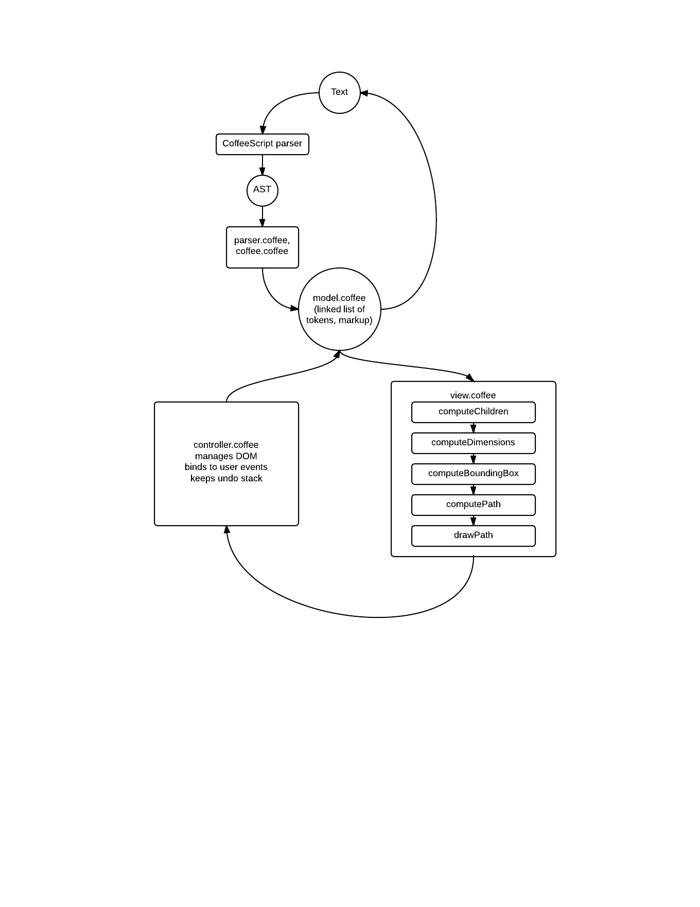

ICE Editor Architecture
=======================

Ice Editor has five files: `model.coffee`, `view.coffee`, `controller.coffee`, `parser.coffee`, and `coffee.coffee`.

model.coffee
------------
`model.coffee` contains the class definitions for ICE editor data. ICE editor data is a linked list of tokens, some of which are XML-style markup (blockStart, blockEnd, etc.). When text is parsed into this linked list, every character (with the exception of leading whitespace) must go into some text token, so reserialization into text simply involves throwing markup away and concatenating the text tokens (except for leading whitespace, which is reinserted).

Every data class will have an associated rendering class in view.coffee, and each data object will contain a pointer to an instance of the corresponding view class. This is so that data generated during rendering can be persistent, as the controller needs to know some things for hit testing.

view.coffee
-----------
`view.coffee` contains the class definitions for the ICE editor renderers. As mentioned before, each data class in `model.coffee` retains a poiner to a corresponding renderer object.

Rendering is done line-by-line. Each block computes its desired bounding box *on each line*, then draws a path that connects all the bounding boxes.

Rendering occurs in six passes:
  1. `computeChildren`. This runs through the linked list and determines which tokens lie on which lines, and which child blocks occupy which lines.
  2. `computeDimensions`. This recursively computes the size of the bounding box for this block on each given line.
  3. `computeBoundingBox`. This recursively computes the position of the bounding box for this block on each given line.
  4. `computePath`. For blocks that need to draw a path, this connects the bounding boxes into one path for drawing. Simultaneously computes the drop target area, if this block is a valid drop target.
  5. `drawPath`. This actively draws the path on the given canvas.
  6. `drawCursor`. This should be a no-op except for the block that immediately contains the cursor. This occurs in a separate pass from `drawPath` because the cursor must be the topmost object.

controller.coffee
-----------------
`controller.coffee` binds to user events, manages the DOM, and manages the undo stack. It defines the `Editor` class, which is the API-level class, and contains all editor state.

The controller is organized into "features". Features bind to events and give these bindings priorities (for execution order). This is the `hook` function, which takes an event name, a priority, and a handler.

All undo operations are object whose classes descend from `UndoOperation`. They each have an `undo` and `redo` function which can be called on an `Editor` instance.

parser.coffee
-------------
`parser.coffee` is a utility wrapper for ICE editor parsers. It defines a `Parser` class, which can be instantiated on a parsing function. The parsing function is expected to return an array of markup with locations (e.g. "blockStart at location 5"), and the utility wrapper will generated the linked list from this markup, automatically splicing the original text into `TextToken`s between the returned markup.

coffee.coffee
-------------
`coffee.coffee` defines the parsing function passed to `parser.coffee` for the CoffeeScript blocks. It runs the CoffeeScript standard parser, then transforms the CoffeeScript AST into a markup array using location data.
